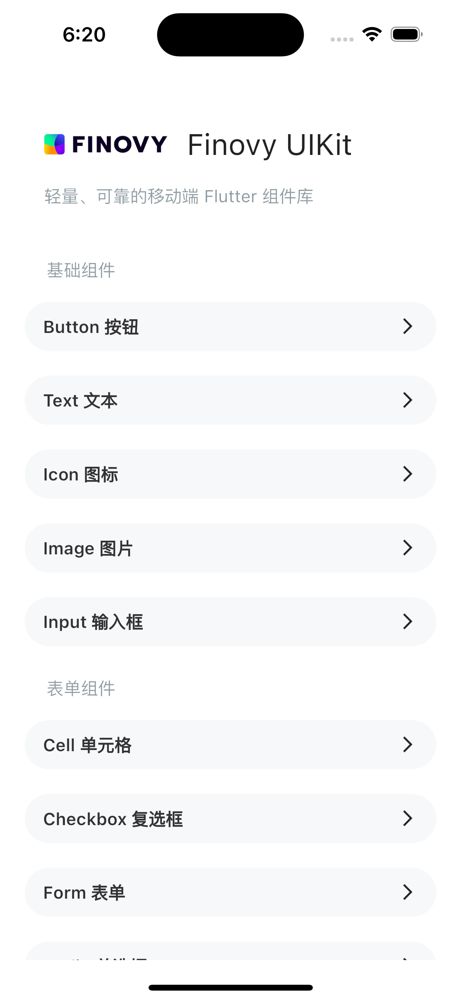
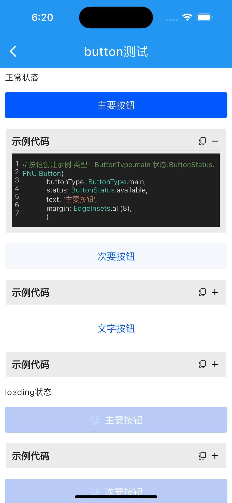
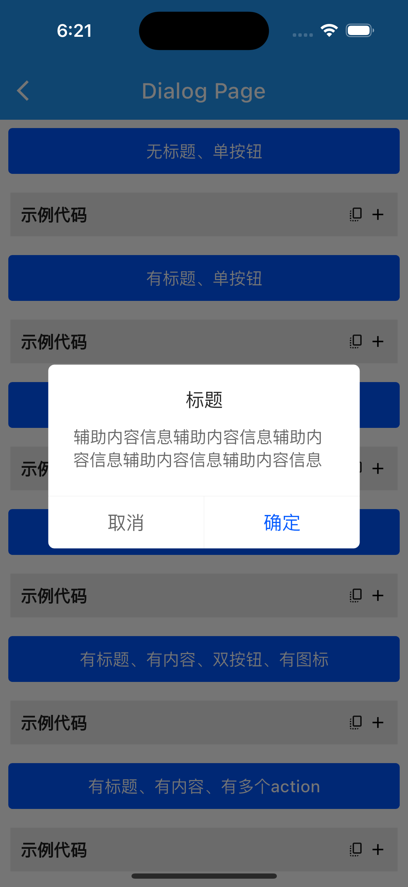
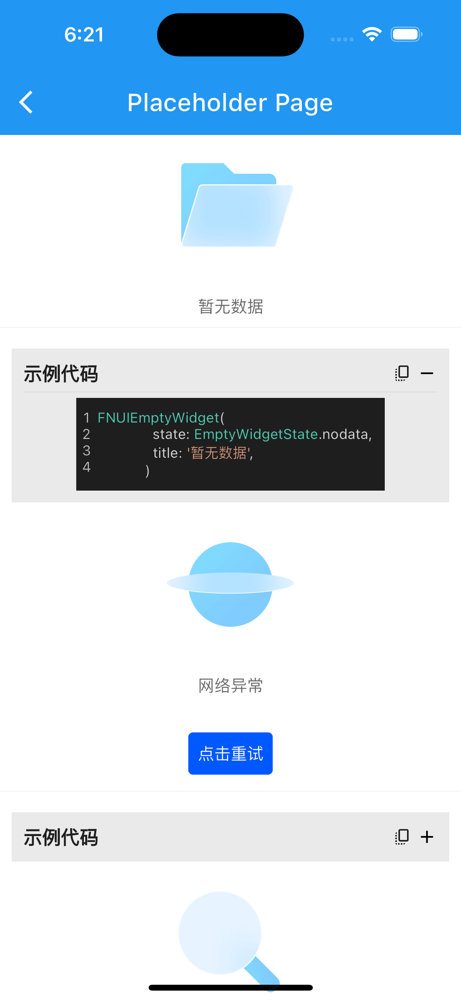

# Finovy UIKit Example Project

A lightweight and reliable mobile Flutter component library

English | [中文版](README_CN.md)
## **1. Usage**

Add the following line to the dependencies section in the pubspec.yaml file:

```dart
fn_ui_kit:
	git:
          url: https://github.com/finovy/finovy_ui_kit.git
```


## **2. Basic Information of the Component Library**

|              **Name**               |                       **fn\_ui\_kit**                        |
| :---------------------------------: | :----------------------------------------------------------: |
|            **Category**             |                              UI                              |
|      **Development Framework**      |                           flutter                            |
|      **Development Language**       |                             Dart                             |
| **Minimum Environment Requirement** |           flutter >=3.0.0    dart >=2.17.0 <=4.0.0           |
|         **Current Version**         |                            1\.0.0                            |
|    **Third-Party Dependencies**     | [auto_size_text](https://pub.dev/packages/auto_size_text)  [pin_code_fields](https://pub.dev/packages/pin_code_fields)   [pull_to _refesh](https://pub.dev/packages/pull_to_refresh)  [visibility_detector](https://pub.dev/packages/visibility_detector) |
|     **Open Source Repository**      |         https://github.com/finovy/finovy_ui_kit.git          |

## **三、相关截图**
<div style="display:inline-block">

<br>


</div>


