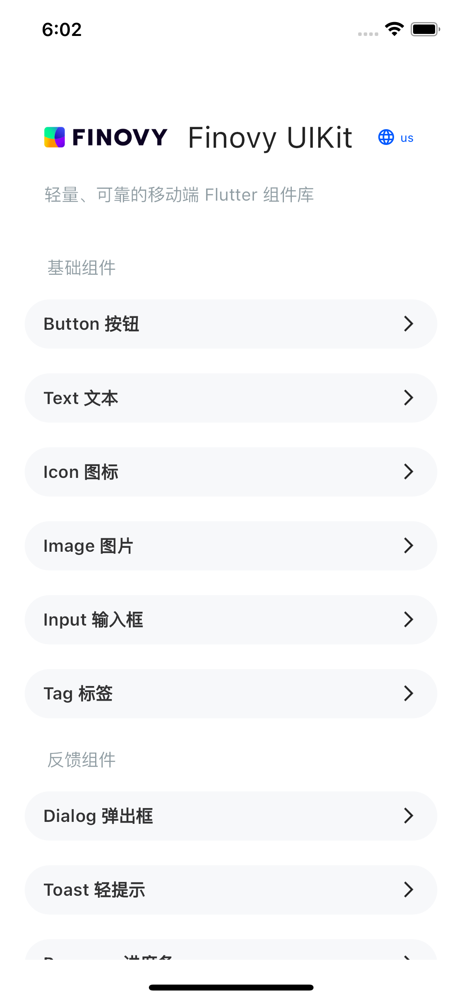
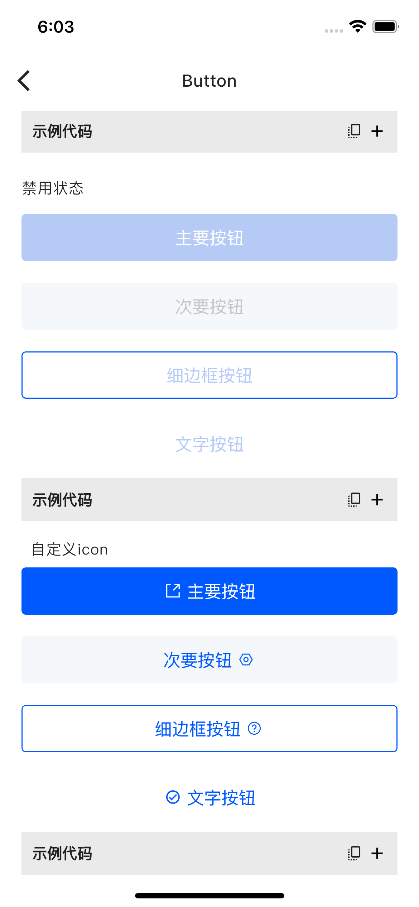
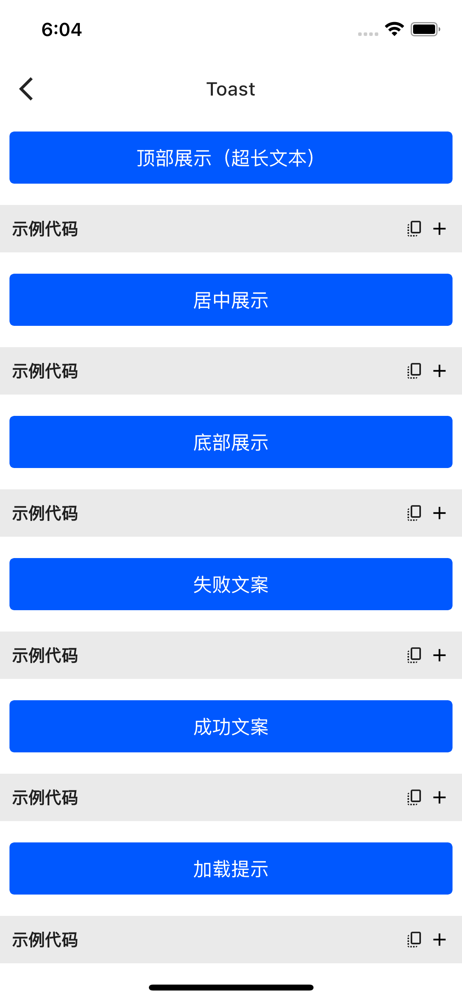

# Finovy UIKit 示例工程

轻量、可靠的移动端Flutter组件库

[English](README.md) | 中文版
## **一、使用方法**
在pubspec.yaml文件dependencies节点加入：
```dart
fn_ui_kit:
  git:
    url: https://github.com/finovy/finovy_ui_kit.git
```

## **二、组件库基础信息**

|**名称**|                                                                                                                      **fn\_ui\_kit**                                                                                                                      |
| :-: |:---------------------------------------------------------------------------------------------------------------------------------------------------------------------------------------------------------------------------------------------------------:|
|**使用类别**|                                                                                                                            UI类                                                                                                                            |
|**开发框架**|                                                                                                                          flutter                                                                                                                          |
|**开发语言**|                                                                                                                           Dart                                                                                                                            |
|**最低环境要求**|                                                                                                         flutter >=3.0.0    dart >=2.17.0 <=4.0.0                                                                                                          |
|**当前版本**|                                                                                                                          1\.1.0                                                                                                                           |
|**第三方依赖**| [auto_size_text](https://pub.dev/packages/auto_size_text)  [pin_code_fields](https://pub.dev/packages/pin_code_fields)   [pull_to _refesh](https://pub.dev/packages/pull_to_refresh)  [visibility_detector](https://pub.dev/packages/visibility_detector) |
|**开源地址**|                                                                                                        https://github.com/finovy/finovy_ui_kit.git                                                                                                        |
## **三、相关截图**
<div style="display:inline-block">

<br>



<br>



<br>


</div>


